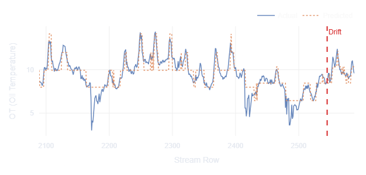
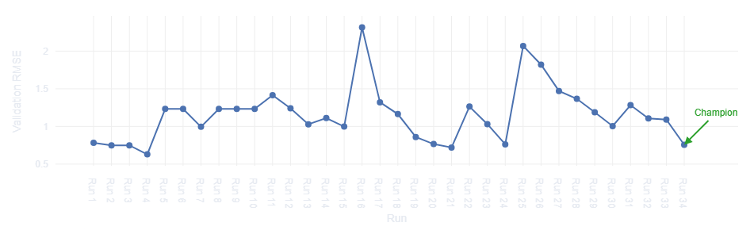

# AdaptCast

Adaptive time series forecasting pipeline with automated concept drift detection, model retraining, and a live monitoring dashboard.

[](https://www.python.org/downloads/)
[](#running-tests)
[](LICENSE)

---

## Overview

AdaptCast trains a LightGBM baseline on the [ETTh1](https://github.com/zhouhaoyi/ETDataset) electricity transformer dataset, streams new observations row-by-row, and uses three statistical drift detectors (ADWIN, Page-Hinkley, KSWIN) to decide when the data distribution has shifted. When drift is detected, an online learner (river's `HoeffdingAdaptiveTreeRegressor`) or a full LightGBM retrain is triggered depending on severity. The new model is promoted to champion only if it outperforms the current champion on the **same drifted validation window** — ensuring a fair, apples-to-apples comparison. All experiments are tracked in MLflow, a FastAPI service exposes predictions, and a Streamlit + Plotly dashboard gives live visibility into drift events, model versions, and forecast accuracy.

---

## Screenshots

| Actual vs Predicted | RMSE History |
|:-------------------:|:------------:|
|  |  |

---

## Results

### Baseline Performance

| Metric | Value |
|--------|-------|
| Dataset | ETTh1 — 17,420 hourly observations |
| Target | OT (Oil Temperature) |
| Train / Val / Test split | 70% / 15% / 15% |
| Baseline model | LightGBM (5-fold time-series CV + early stopping) |
| **Baseline Val RMSE** | **0.6295** |

### Streaming Results (2,589 test rows)

| Metric | Value |
|--------|-------|
| Total drift events detected | 39 |
| Model versions created | 26 |
| Successful promotions | 13 |
| Final champion RMSE | 0.7565 |
| Detectors fired | ADWIN, Page-Hinkley, KSWIN |

### Model Evolution

The promotion gate re-evaluates the champion on the **same drifted data** as the challenger, enabling fair comparison. When the data distribution shifts, the champion degrades on new data — allowing better-adapted challengers to take over.

| Version | Val RMSE | Mode | Event |
|---------|----------|------|-------|
| v3 | 0.6295 | — | Initial baseline (trained on full data) |
| v4 | 1.2413 | Mode B (full retrain) | First promotion after drift |
| v5 | 1.0284 | Mode B | Improvement on drifted data |
| v7 | 0.9979 | Mode B | Continued adaptation |
| v11 | 0.8601 | Mode A (online) | Recovery phase |
| v13 | 0.7209 | Mode A | Near-baseline quality |
| v26 | **0.7565** | Mode A | **Final champion** |

> RMSE increases after drift (distribution shift), then gradually recovers as the pipeline adapts — demonstrating the full MLOps lifecycle.

---

## Architecture

```
ETTh1.csv
    │
    ▼
src/data/preprocess.py   ←── lag features (1,24,168), rolling stats, train/val/test split
    │                         (feature config loaded from configs/model.yaml)
    ▼
src/models/baseline.py   ←── LightGBM train + time-series CV + early stopping + MLflow logging
    │
    ▼  champion alias
src/models/registry.py   ←── MLflow model registry  ──────────────────────────┐
    │                                                                           │
    ▼  row-by-row stream                                                        │
src/data/stream.py                                                              │
    │                                                                           │
    ▼  residuals                                                                │
src/drift/monitor.py     ←── ADWIN │ Page-Hinkley │ KSWIN                     │
    │  DriftEvent (detectors accumulate continuously — no auto-reset)           │
    ▼                                                                           │
src/drift/retrainer.py   ←── online update (river) or full retrain ────────────┘
    │                         fair eval: champion re-evaluated on drifted data
    ▼
src/serving/app.py       ←── FastAPI  (uvicorn, port 8000)
    │
    ▼
src/dashboard/app.py     ←── Streamlit + Plotly (port 8501)
```

---

## Tech Stack

| Component | Library | Purpose |
|-----------|---------|---------|
| Baseline model | LightGBM | Gradient-boosted trees for fast, accurate forecasting |
| Online learning | river | Incremental `HoeffdingAdaptiveTreeRegressor` + drift detectors |
| Experiment tracking | MLflow | Run logging, model registry, champion/challenger aliasing |
| API serving | FastAPI + uvicorn | Async HTTP endpoints with Pydantic v2 validation |
| Dashboard | Streamlit + Plotly | Interactive monitoring UI with zero JavaScript |
| Data | pandas + pyarrow | DataFrame ops, Parquet I/O |
| Testing | pytest | 25 unit + integration tests |

---

## Quick Start

**Prerequisites:** Python 3.11+, pip.

```bash
# 1. Install dependencies
pip install -e ".[dev]"

# 2. Download and preprocess data
python -m src.data.download
python -m src.data.preprocess

# 3. Train baseline model (logs to MLflow)
python -m src.models.baseline

# 4. Start prediction API (separate terminal)
uvicorn src.serving.app:app --host 0.0.0.0 --port 8000

# 5. Start dashboard (separate terminal)
streamlit run src/dashboard/app.py
```

Or use the Makefile shortcuts:

```bash
make install
make data
make train
make serve      # terminal 1
make dashboard  # terminal 2
```

Then open http://localhost:8501 and click **Start Stream** to watch live drift detection and model adaptation.

---

## API Reference

Base URL: `http://localhost:8000` — Interactive docs: `http://localhost:8000/docs`

| Method | Path | Description |
|--------|------|-------------|
| GET | `/health` | Liveness check |
| POST | `/predict` | Single-step forecast (with optional ground truth) |
| GET | `/model/info` | Current champion metadata |
| GET | `/model/versions` | All registered model versions |
| POST | `/model/rollback` | Promote a specific version to champion |
| GET | `/drift/status` | Drift detector readings and event count |
| POST | `/drift/reset` | Reset all drift detectors |
| GET | `/predictions/history` | Recent prediction/actual pairs |
| GET | `/mlflow/runs` | All MLflow training run history |
| POST | `/stream/start` | Start streaming test data through the pipeline |
| POST | `/stream/stop` | Stop the active stream |
| GET | `/stream/status` | Stream progress (rows processed / total) |

---

## Running Tests

```bash
pytest -v
# Expected: 25 tests pass
```

---

## Project Structure

```
AdaptCast/
├── configs/
│   ├── drift.yaml          # detector thresholds (delta, alpha, window sizes)
│   ├── model.yaml          # LightGBM hyperparameters + feature config (lags, windows, target)
│   └── serving.yaml        # API port, MLflow URI, dashboard refresh interval
├── src/
│   ├── data/               # download, preprocess, stream
│   ├── drift/              # detectors, monitor, retrainer
│   ├── models/             # baseline (LightGBM), online (river), registry
│   ├── serving/            # FastAPI app, routes, schemas
│   └── dashboard/          # Streamlit app + Plotly components
├── tests/                  # 25 pytest tests
├── notebooks/              # EDA, feature engineering, drift simulation
├── pyproject.toml
├── Makefile
└── README.md
```

---

## Key Design Decisions

| Decision | Choice | Rationale |
|----------|--------|-----------|
| Baseline model | LightGBM | Trains in seconds; matches LSTM on ~17 k tabular rows |
| Online model | river `HoeffdingAdaptiveTreeRegressor` | Purpose-built for streaming; same library as detectors |
| Drift detectors | ADWIN + Page-Hinkley + KSWIN | Complementary: window, cumsum, non-parametric |
| Promotion gate | Re-evaluate champion on drifted data | Fair comparison — prevents stale metrics from blocking adaptation |
| Experiment tracking | MLflow (local SQLite) | No cloud account required; built-in model registry |
| Model serialization | joblib | Safer than pickle; no arbitrary code execution on load |
| Serving | FastAPI + uvicorn | Native async; auto OpenAPI docs; Pydantic v2 |
| Dashboard | Streamlit + Plotly | Zero JavaScript; interactive charts; rapid iteration |

